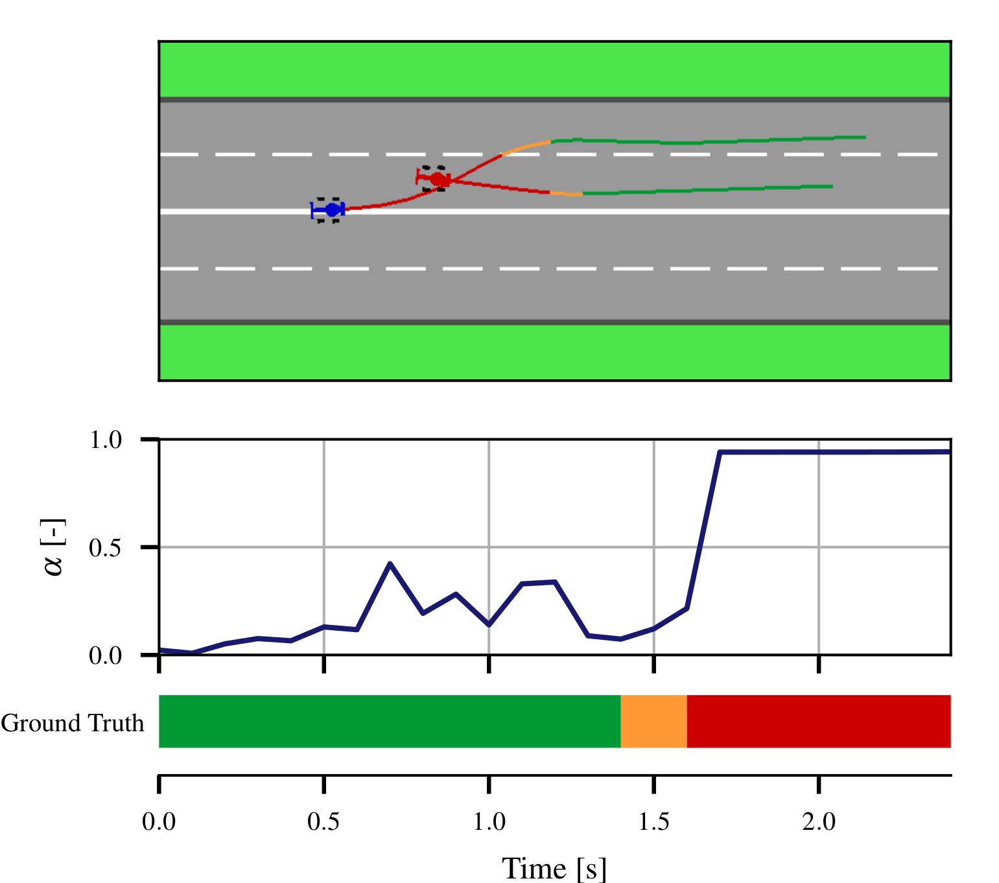

# Anomaly Detection in Multi-Agent Trajectories for Automated Driving
This is the official project page including the paper, code, simulation, baseline models and the dataset.

**[Anomaly Detection in Multi-Agent Trajectories for Automated Driving](https://openreview.net/forum?id=tmZsuYPmQ9m)**
<br>
Julian Wiederer, Arij Bouazizi, Marco Troina, Ulrich Kressel, Vasileios Belagiannis
<br>
*Accepted for poster at [CoRL 2021](https://www.robot-learning.org/) in London, UK.*
<br>

<!------>

<div align="center">

</div>

## Installation

Setup the anaconda environment by running the command:
```bash
conda env create -f environment.yml
```

## Simulation

We provide the code for the highway simulation as reported in the paper. Start the simulation by running:

```bash
cd simulation
python gym_highway_simulation.py
```

This will simulate a two-agent scenario on a two-lane highway. Control the blue agent with the `[arrow keys]` and the red 
agent with `[W, A, S, D]`. Press `Esc` to exit the simulation and 
safe the recording following the prompts in the terminal. This will create the output directory in `/recordings` and
exports the simulation in a `*_data.npy` and `*_meta.json` file. 

The data file is of shape `N x T x 7`, with `N` agents, `T` time steps and seven states. The states are 
`[time steps, x, y, angle, steer, gas, break]` with the trajectory 
states `x, y` and `angle` and the action states `steer, gas` and `break`. The meta file includes details on the 
simulation environment, the agent initial positions, the annotation and the name of the 
human controllers in a dictionary structure. 

## Dataset

##### Requesting Access
To optain the multi-agent anomaly detection (MAAD) highway dataset, please send an email to *maad.highway@gmail.com* 
with subject matter '[CoRL2021] MAAD Highway Dataset - Access Request' stating the following:

&nbsp;&nbsp;&nbsp;&nbsp;&nbsp;&nbsp; *Your name, title and affiliation*
<br>
&nbsp;&nbsp;&nbsp;&nbsp;&nbsp;&nbsp; *Your intended use of the data*
<br>
&nbsp;&nbsp;&nbsp;&nbsp;&nbsp;&nbsp; The following license statement:
<br>
&nbsp;&nbsp;&nbsp;&nbsp;&nbsp;&nbsp; *With this e-mail I agree that I will use the MAAD Highway dataset 
following the Creative Common Attribution-NonCommercial 4.0 International License.*

We will promptly reply with a download link. Enter the download link into `/scripts/download_dataset.sh` 
and the run commands

```
chmod +x download_dataset.sh
./download_dataset.sh
```

##### License

<a rel="license" href="http://creativecommons.org/licenses/by-nc/4.0/">
</a><br />MAAD Highway dataset is licensed under <a rel="license" href="http://creativecommons.org/licenses/by-nc/4.0/"
 >Creative Commons Attribution-NonCommercial 4.0 International License</a>.

##### Dataset Definition
As soon as you have received the download link, downlaod the .zip file and unpack into /datasets/maad. This results in the following structure:

```
datasets/maad
│   
└───test
│   │   abnormal_00000x.txt
│   │   ...
|   |   normal_00000x.txt
|   |   ...
│
└───test_ablation_beyond_pairs
│   │   abnormal_00000x.txt
│   │   ...
│   │   normal_00000x.txt
|   |   ...
│
└───train
│   │   normal_00000x.txt
|   |   ...
```

Each .txt represents one scene and is described by the columns {frame-id, timestamp, agent-id, x, y, major-label, minor-label}. The x- and y-coordinates are provided in the global scene coordinate system, i.e. the same for all sequences. 

##### Label Definition
As stated in the paper, we provide major and minor labels. Major label mapping is defined as:

```
0   =   normal
1   =   abnormal
2   =   ignore
```

The minor label definition describes the driving maneuvers and is defined as:

```
-1  =   void
0   =   aggressive overtaking
1   =   pushing aside
2   =   right spreading
3   =   left spreading
4   =   tailgating
5   =   thwarting
6   =   leave road
7   =   staggering
8   =   skidding
9   =   wrong-way driving
10  =   aggressive reeving
11  =   else
```

##### Data Loader
We provide a data loader for the MAAD Highway dataset in `/scripts/dataset.py`.

## Anomaly Detection Methods

We provide instructions to train and test all methods presented in the CoRL 2021 paper including 
the seven baseline methods for anomaly detection:

- CVM
- LTI
- Seq2Seq
- STGAE-biv | A=I
- STGAE-mse
- STGAE-biv
- STGAE-biv+OC-SVM
- STGAE-biv+KDE (OURs)

Additionally we provide pre-trained models for each learned method. Download the models from google drive and unzip 
 the .zip file in the `/experiments` directory.
 
 https://drive.google.com/file/d/1SBqsKf0KSErTx4k3gEd4DBAG6ILLOQqY/view?usp=sharing
  
More details see below for each method in particular.

##### STGAE-biv, STGAE-mse & STGAE-biv | A=I

###### Training
For training the spatio-temporal graph auto-encoder model adapt the `/config/config_stgae_train.yaml` accordingly,
e.g. change the loss from `bivariate` to `mse` or set the adjacency type to `identity` (A=I). 
Then run:

```bash
python train_stgae.py
```

###### Testing
For testing the reconstruction methods on the anomaly detection task, set `test_set: "train"` in 
the `/config/config_stgae_test.yaml`, adapt the `run_name` and run:

```bash
python test_stgae.py
```

This will create an evaluation directory in the experiment folder with the results. We provide pre-trained models 
for each STGAE-variant `stgae_bivariate_loss_corl21`,
`stgae_mse_loss_corl21` and `stgae_bivariate_loss_adjacency_identity_corl21`, which you can test out-of-the-box.

##### STGAE-biv+OC-SVM & STGAE-biv+KDE (OURs)

###### Training
To train the one-class anomaly detection methods OC-SVM and KDE we need a trained feature encoder STGAE. 
Therefore, first train STGAE-biv as described above.
Second, train the KDE on the latent representation 
of the trained STGAE model. Export the latent features of the trained STGAE on the training set:

```bash
python test_stgae.py
```

This will simultaneously evaluate the STGAE on the anomaly detection task and create an evaluation directory in the 
STGAE experiment as before. The latent features are stored in the `prediction_data.pkl`. 
To create the KDE model on the exported features run:

```bash
python train_one_class.py
```

You can adapt the configuration file `/config/config_one-class_train.yaml`, e.g. to train the OC-SVM instead of the KDE.

###### Testing

For testing, we encode the test set by setting `test_set: "test"` in the  `/config/config_stgae_test.yaml` and run:

```bash
python test_stgae.py
```

After encoding adopt `/config/config_one-class_test.yaml` and run:

```bash
python test_one_class.py
```

This will evaluate the one-class anomaly detection method. We provide pre-trained models for OC-SVM and KDE, namely 
`ocsvm_corl21` and `kde_corl21`, respectively.

##### Seq2Seq

###### Training

Adopt the configuration `/config/config_seq2seq_train.yaml` and run

```bash
python train_seq2seq.py
```

to train the Seq2Seq LSTM for 500 epochs.

###### Testing

For testing run adopt `/config/config_seq2seq_test.yaml` and run

```bash
python test_seq2seq.py
```

You can use our pre-trained model `seq2seq_corl21` for direct evaluation.

##### Linear Models: CVM & LTI

The linear models Constant Velocity Model (CVM) and Linear Temporal Interpolation (LTI) do not require training. 
We provide functionality to test both models on the MAAD test set.

###### Testing
Select the method, CVM or LTI, in the configuration `/config/config_linear_test.yaml` and run 

```bash
python test_linear_model.py
```

Since CVM and LTI are deterministic, we do not provide any pre-trained models.

## Citation

If you find this code, simulation or dataset useful, please cite our CoRL 2021 paper:

```bibtex
@inproceedings{MAAD2021,
    title={Anomaly Detection in Multi-Agent Trajectories for Automated Driving},
    author={Julian Wiederer and Arij Bouazizi and Marco Troina and Ulrich Kressel and Vasileios Belagiannis},
    booktitle={Conference on Robot Learning},
    year={2021}
}
```